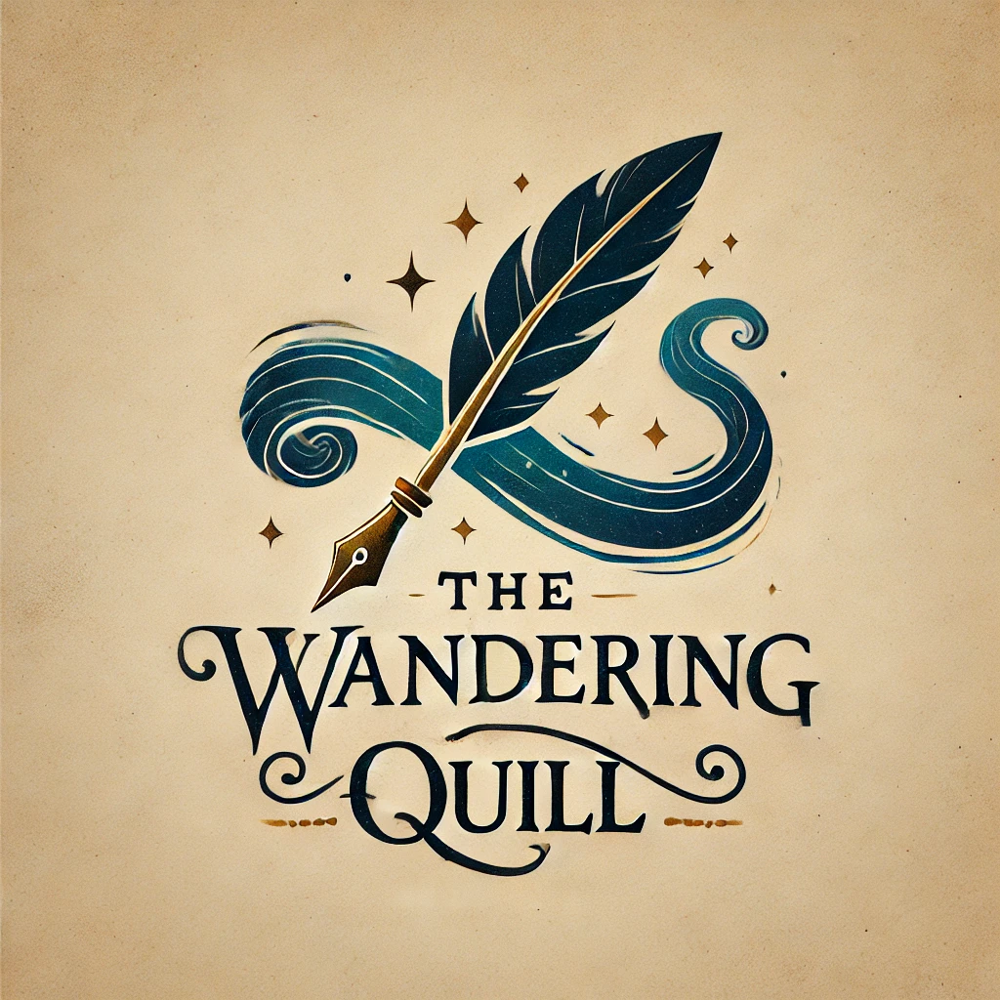
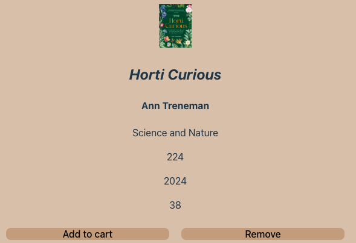
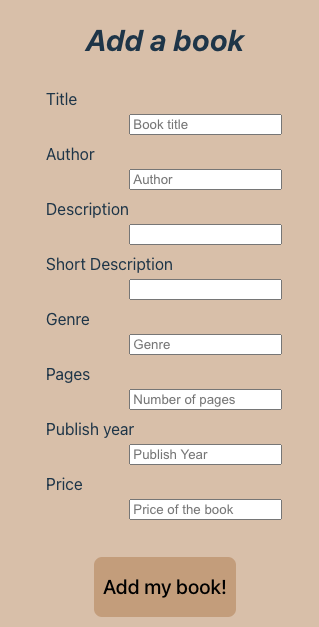
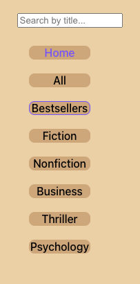
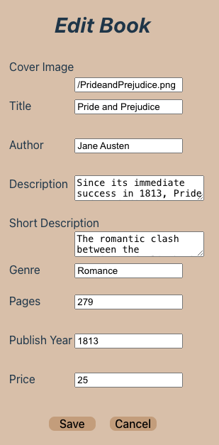

# The Wandering Quill - The library of your dreams

## Description

The website is designed as a library to find gems of literature. 
Users can search through the book list and put the books they like as favourites, add them to a Cart, edit them, or from the Favourites or Cart pages, delete them too. 
You can also Add new books for sale.

## Tech stack

Built with React JS, CSS, HTML, updating to a Backend server.
Deployed in Netlify and Vercel

## Design

The website is designed keeping the main elements in focus, so it's easier to understand the user interface.

## Features

- **Responsive Design**: The website is fully responsive, providing all features across all devices and screen sizes.
- **CRUD**: The website offers users all the CRUD operations, by being able to Add new books, updating them, adding books to favorites and cart and deleting them.
- **Page Not Found**: Navigating to any invalid link the website will give a Page Not Found. 
   

## How to run the project

Click on the link to load the page in the browser.
_(https://the-wandering-quill.netlify.app/)_

## How to Navigate through the website

- HomePage: On loading the site, the user lands on the HomePage. 
   
   It is built of below sections 

  - Navbar: This is fixed website header & does not change during the navigation.
     
    Contents:

    - This holds the website Logo, and the name of the Library, which is clickable and takes you to the homepage.
    - My Favourites with a counter, which will take you to the list of Favourites, where you can delete them or add to Cart.
    - My Cart, with a counter, also here you can delete books from your cart or add them as Favourites.

     

  - Sidebar: This is also fixed and has a Searchbox where you can filter by name of the book and also different bottoms that will filter by genre
  - Homepage: This section displays the contents of the BookList. If using the filter the results will apear here and also any other bottoms like Favourites, Cart or Add a Book.
    If clicking in any book it will appear the Book Detail, where you can Add to Favourites, Add to Cart or Edit
  - Footer: This is fixed website footer & does not change during the navigation. Contents:

    - gitHub Logo along with gitHub repository of the project.
    - About Us, the story of the library.
    - Add a Book, where you can add the book that you want to sell.

       

 
  The website has below features.

- Search: The books can be search on the Book name.
- Filter: The books can be filtered by Genre

   

The BookList is built of Book Cards. Every Card is built of below sections.

- Image: A huge image of the book cover for clear view.
- Book Info: title, author, short description and price are displayed.

- Book Details: Clicking on the Card loads the Homepage section with the Book Details.  
   
  The Book Details is built of below.

  - Image: A small image of the book cover.
  - Book Info: Below the image, the book's title, favourites botton, cart botton and Edit Book botton. Below that you'll find the Author, a detailed description of the book, it's genre, the number of pages, the Publish year and the price.
  - When clicking Edit Book, you will be taken to a form with the book details already prefilled where you can edit the book.

     

<!-- ## Mobile Version

- Fully responsive with Toobar with easy menu access. 
    -->

## Local Deployment and Run Instructions

- Git Clone the project with 'git clone https://github.com/danadi87/the-wandering-quill4'.
- Install the libraries with 'npm install'.
- Run the project locally with 'npm run dev'.
